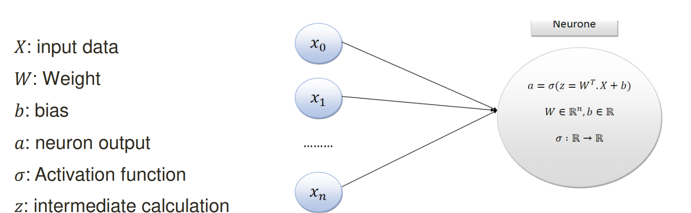
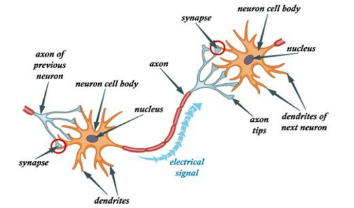
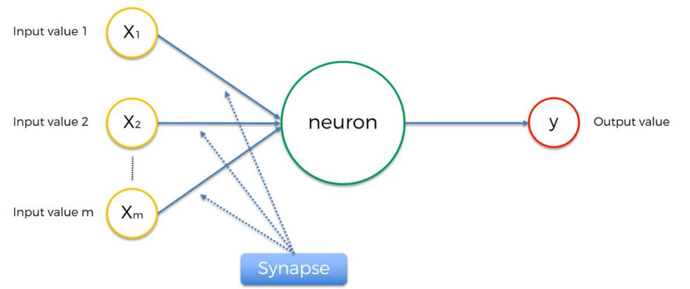
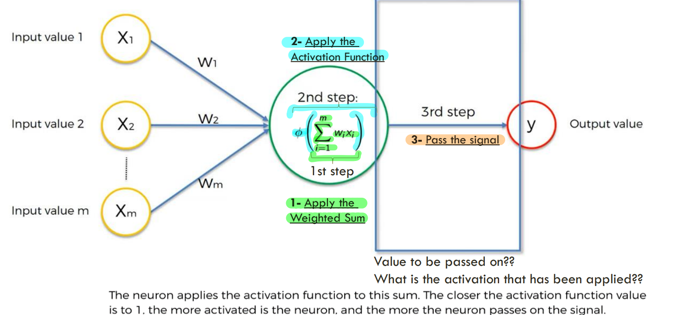
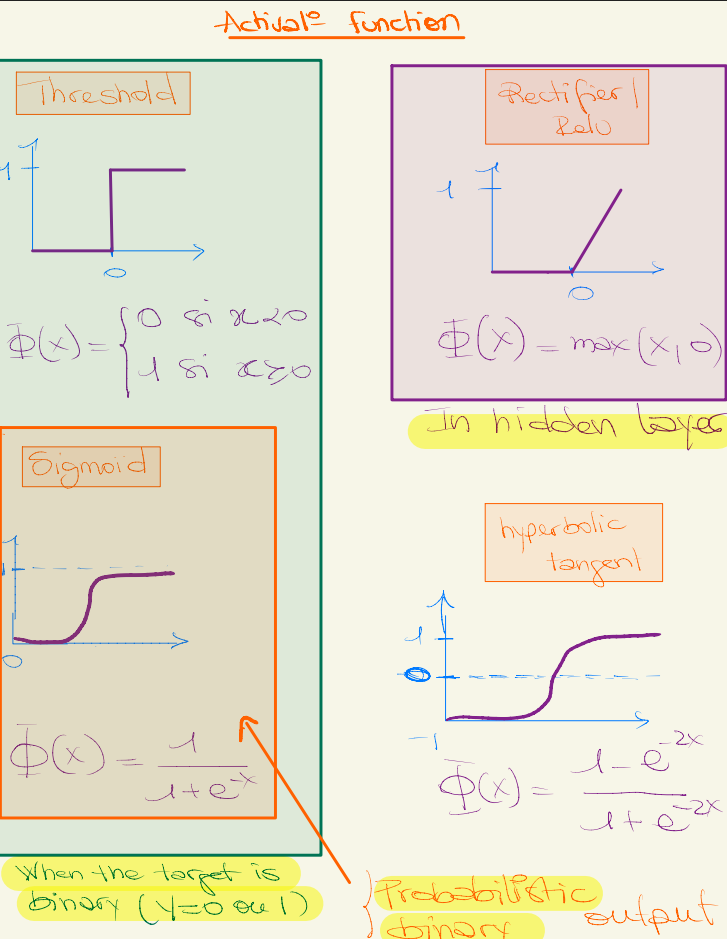
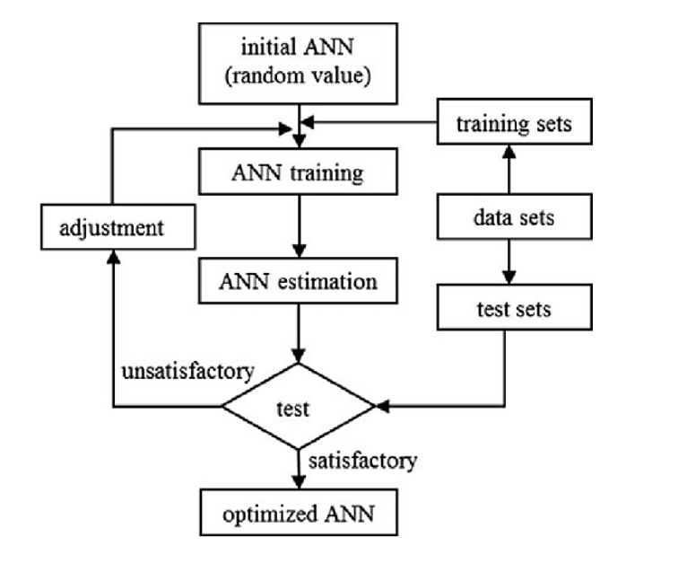

# 🧠 Deep Learning – Artificial Neural Networks (ANN)

---

## 📌 Références principales

* *Machine Learning A-Z* – Kirill Eremenko, @SuperDataScience
* *Deep Learning A-Z* – Kirill Eremenko, Hadelin de Ponteves, @SuperDataScience
* *Deep Learning – Artificial Intelligence* – Sarah Malaeb

---

## 🔹 1. Qu’est-ce que le Deep Learning ?

* **Machine Learning (ML)** est un sous-domaine de l’IA.
* **Deep Learning (DL)** est un sous-domaine du ML.
* Il utilise des **réseaux de neurones artificiels (ANN)** pour simuler la capacité du cerveau humain à apprendre et prendre des décisions.

---

## 🔹 2. Limitations du Machine Learning classique

* Extraction de features manuelle, souvent complexe.
* Difficile pour des problèmes complexes et haute dimension.
* Le Deep Learning apprend automatiquement les représentations pertinentes → réduit le problème de **haute dimensionnalité**.

---

## 🔹 3. Pourquoi "Deep" Learning ?

* Les réseaux sont dits *profonds* car ils comportent plusieurs **couches cachées**.
* L’apprentissage consiste à **mettre à jour les poids** des neurones via une fonction d’optimisation.
* Un neurone calcule :
  [
  z = \sum w_i x_i + b, \quad a = f(z)
  ]

---

## 🔹 4. Techniques en Deep Learning

* Extraction de features supervisée ou non.
* Transformation des données.
* Analyse de motifs.
* Classification.
* Prédiction.

---

## 🔹 5. Vocabulaire clé d’un neurone

* **X** : données d’entrée.
* **W** : poids.
* **b** : biais.
* **z** : somme pondérée intermédiaire.
* **σ** : fonction d’activation.
* **a** : sortie du neurone.




---

## 🔹 6. Réseau de Neurones Artificiel (ANN)


* Réseau le plus simple.
* Aussi appelé **Perceptron multicouche (MLP)**.
* **Feed-forward** : connexions uniquement en avant (pas de cycle).
* L’état interne est uniquement défini par les poids.
* Organisation en **couches** (entrée → cachées → sortie).


---

## 🔹 7. Backpropagation

* **Cœur de tout réseau de neurones**.
* Sert à calculer les gradients efficacement.
* Étapes :

  1. Propagation avant (calcul de la sortie).
  2. Calcul de la fonction de coût (ex : MSE, Cross-Entropy).
  3. Propagation arrière (calcul des gradients).
  4. Mise à jour des poids via un optimiseur (SGD, Adam…).

---

## 🔹 8. Le neurone biologique (analogie)

* **Dendrites** : reçoivent le signal.
* **Axon** : transmet le signal.
* **Synapse** : connexion entre axon d’un neurone et dendrites d’un autre.



📌 Dans l’ANN :

* Dendrites → entrées (X).
* Axon → sortie (a).
* Synapse → poids (W).



---

## 🔹 9. Fonctions d’activation



### 🔸 9.1. Pourquoi a-t-on besoin d’une fonction d’activation ?

Sans fonction d’activation, un réseau de neurones ne serait qu’une **simple combinaison linéaire** des entrées.

Chaque neurone ferait :
[
z = \sum w_i x_i + b
]
et la sortie serait directement $a = z$.

➡️ Même si tu empiles plusieurs couches, tu obtiendras toujours une **fonction linéaire**, équivalente à une **régression linéaire**.

Or, la plupart des phénomènes du monde réel sont **non linéaires** (ex : reconnaissance d’images, langage, sons).
Les fonctions d’activation permettent donc d’introduire une **non-linéarité** indispensable pour que le réseau puisse :

* Apprendre des motifs complexes,
* Combiner des variables de manière non triviale,
* Décider si un neurone doit “s’activer” ou non.

---

### 🔸 9.2. Rôle concret d’une fonction d’activation

Elle transforme la sortie brute du neurone ($z$) en une valeur “activée” ($a$) :
[
a = f(z)
]

Son rôle est de :
✅ **Introduire de la non-linéarité** (rendre le modèle plus puissant),
✅ **Stabiliser ou borner les sorties** (ex : entre 0 et 1),
✅ **Décider l’activation du neurone**,
✅ **Réguler la rétropropagation** (via la dérivée de $f$).



📌 Recommandations :

* Couches cachées → ReLU.
* Sortie binaire → Sigmoid.
* Sortie multi-classes → Softmax.
---

### 🔸 9.3. Fonction de Seuil (Step Function)

Première fonction utilisée historiquement (Perceptron de Rosenblatt) :

[
f(z) =
\begin{cases}
1 & \text{si } z > 0 \
0 & \text{sinon}
\end{cases}
]

📘 **Interprétation** : le neurone s’active seulement si le signal dépasse un certain seuil.

⚠️ **Limite** :

* Non dérivable → inutilisable pour la backpropagation.
* Décision trop brutale (0 ou 1).

---

### 🔸 9.4. Sigmoïde

[
f(z) = \frac{1}{1 + e^{-z}}
]

📘 **Effet** : compresse toute valeur réelle dans l’intervalle (0, 1).
Idéale pour représenter une **probabilité**.

📊 **Dérivée** :
[
f'(z) = f(z)(1 - f(z))
]

✅ **Avantages** :

* Interprétation probabiliste.
* Lisse et différentiable.

⚠️ **Inconvénients** :

* **Vanishing gradient** : les gradients deviennent très faibles pour $|z|$ grands.
* Centrée sur 0.5 → apprentissage lent.

📍 **Utilisation typique** : sortie binaire (ex : churn / non churn).

---

### 🔸 9.5. Tangente Hyperbolique (tanh)

[
f(z) = \tanh(z) = \frac{e^z - e^{-z}}{e^z + e^{-z}}
]

📘 **Effet** : valeurs entre -1 et 1.
Plus “centrée” que la sigmoïde (valeurs moyennes autour de 0 → plus stable).

✅ **Avantages** :

* Sorties centrées → apprentissage plus rapide.

⚠️ **Inconvénients** :

* Vanishing gradient pour valeurs extrêmes.

📍 **Utilisation typique** : couches cachées dans petits réseaux ou RNN.

---

### 🔸 9.6. ReLU (Rectified Linear Unit)

[
f(z) = \max(0, z)
]

📘 **Principe** :

* Si $z > 0$, le neurone transmet sa valeur.
* Si $z \le 0$, il est “éteint” (sortie = 0).

✅ **Avantages** :

* Calcul très rapide.
* Atténue le problème du vanishing gradient.
* Rend le réseau plus profond et plus stable.

⚠️ **Inconvénients** :

* **Dying ReLU problem** : certains neurones restent bloqués à 0 si les poids deviennent trop négatifs.

📍 **Utilisation typique** : toutes les couches cachées des réseaux profonds (CNN, ANN, etc.).

---

### 🔸 9.7. Leaky ReLU

[
f(z) =
\begin{cases}
z & \text{si } z > 0 \
0.01z & \text{sinon}
\end{cases}
]

📘 **Principe** :
Corrige le “dying ReLU” en gardant un petit flux d’information même quand $z<0$.

✅ **Avantages** :

* Apprentissage plus fluide.
* Zéro neurone bloqué.

📍 **Utilisation typique** : couches cachées (alternative à ReLU).

---

### 🔸 9.8. Softmax

[
f(z_i) = \frac{e^{z_i}}{\sum_j e^{z_j}}
]

📘 **Principe** : transforme un vecteur de scores $(z_1, z_2, ..., z_n)$ en **probabilités normalisées** dont la somme vaut 1.

✅ **Avantages** :

* Interprétation directe en probabilité.
* Idéale pour multi-classes.

⚠️ **Inconvénients** :

* Sensible aux valeurs extrêmes de $z$.

📍 **Utilisation typique** : couche de sortie des modèles de classification multi-classes (ex : reconnaissance d’images).

---

### 🔸 9.9. En résumé – Choix de la fonction d’activation

| Type de couche       | Fonction d’activation recommandée | Cas d’usage                       |
| -------------------- | --------------------------------- | --------------------------------- |
| Couches cachées      | ReLU / Leaky ReLU / tanh          | Apprentissage profond             |
| Sortie binaire       | Sigmoid                           | Classification binaire            |
| Sortie multi-classe  | Softmax                           | Classification d’images / texte   |
| Réseaux récurrents   | tanh / ReLU                       | Séquences temporelles             |
| Réseaux peu profonds | tanh                              | Modèles simples / petits datasets |

---

### 🔸 9.10. Illustration (à ajouter en images)

Je te recommande d’intégrer ces **visuels explicatifs** dans ton Markdown :

1. **Courbes d’activation :**

   * Axe X = $z$
   * Axe Y = $f(z)$
   * Tracer Sigmoid, tanh, ReLU et Leaky ReLU sur le même graphique.

2. **Schéma d’un neurone avec activation :**

   ```
   Entrées → Somme pondérée → Fonction d’activation → Sortie
   ```

3. **Tableau de comparaison** (comme ci-dessus) à afficher sous forme d’image.

---

## 🔹 10. Comment un ANN apprend ?

1. On calcule la sortie ŷ pour chaque entrée X.
2. On compare à la vérité terrain Y via une **fonction de coût**.
3. On ajuste les poids W pour minimiser l’erreur.
4. On répète sur plusieurs **époques** (epochs).



---

## 🔹 11. Descente de gradient

* Méthode pour trouver les poids qui minimisent la fonction de coût.
* **Batch Gradient Descent** : mise à jour après tout le dataset.
* **Stochastic Gradient Descent (SGD)** : mise à jour après chaque exemple.
* **Mini-Batch Gradient Descent** : compromis (lot de données).


---

## 🔹 12. Hyperparamètres de l’ANN

* **Learning rate** : vitesse d’apprentissage.
* **Batch size** : taille d’un lot d’échantillons.
* **Nombre d’époques** : combien de fois on parcourt les données.

---

## 🔹 13. Exemple pratique avec Keras (Churn bancaire)

### Étapes :

1. Charger et préparer les données.
2. Encoder les variables catégorielles.
3. Séparer en train/test.
4. Normaliser (feature scaling).
5. Construire le modèle ANN.
6. Compiler le modèle.
7. Entraîner.
8. Évaluer.

### Exemple de code :

```python
from tensorflow.keras.models import Sequential
from tensorflow.keras.layers import Dense

# Initialisation
model = Sequential()

# Couche d’entrée et première couche cachée
model.add(Dense(units=6, activation='relu', input_dim=11, kernel_initializer='uniform'))

# Deuxième couche cachée
model.add(Dense(units=6, activation='relu', kernel_initializer='uniform'))

# Couche de sortie (binaire)
model.add(Dense(units=1, activation='sigmoid', kernel_initializer='uniform'))

# Compilation
model.compile(optimizer='adam', loss='binary_crossentropy', metrics=['accuracy'])

# Entraînement
model.fit(X_train, y_train, batch_size=32, epochs=50, validation_split=0.2)
```

---

## 🔹 14. Optimisation d’un ANN

* **Pruning** : supprimer des neurones inutiles.
* **Regularization** : L1/L2, Dropout → éviter l’overfitting.
* **Hyperparameter tuning** : ajuster learning rate, batch size, nombre de couches, etc.

---

## 🔹 15. Keras

* API haut-niveau pour créer rapidement des réseaux de neurones.
* S’appuie sur TensorFlow, CNTK, ou Theano.
* Syntaxe simple, idéale pour prototyper.

---

# ✅ Conclusion

Les **ANN** sont la base du Deep Learning :

* Ils imitent le fonctionnement du cerveau humain.
* Leur puissance vient de la **profondeur** (couches multiples) et de l’**optimisation** via backpropagation.
* Ils sont flexibles mais adaptés surtout aux **données tabulaires**.
* Pour images → CNN, pour séquences → RNN/LSTM/Transformers.


