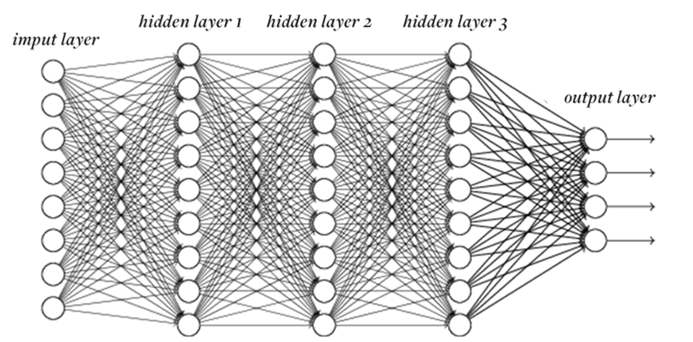

# 🧠 Deep Learning – Artificial Neural Networks (ANN)

---

## 📌 Références principales

* *Machine Learning A-Z* – Kirill Eremenko, @SuperDataScience
* *Deep Learning A-Z* – Kirill Eremenko, Hadelin de Ponteves, @SuperDataScience
* *Deep Learning – Artificial Intelligence* – Sarah Malaeb

---

## 🔹 1. Qu’est-ce que le Deep Learning ?

* **Machine Learning (ML)** est un sous-domaine de l’IA.
* **Deep Learning (DL)** est un sous-domaine du ML.
* Il utilise des **réseaux de neurones artificiels (ANN)** pour simuler la capacité du cerveau humain à apprendre et prendre des décisions.

---

## 🔹 2. Limitations du Machine Learning classique

* Extraction de features manuelle, souvent complexe.
* Difficile pour des problèmes complexes et haute dimension.
* Le Deep Learning apprend automatiquement les représentations pertinentes → réduit le problème de **haute dimensionnalité**.

---

## 🔹 3. Pourquoi "Deep" Learning ?

* Les réseaux sont dits *profonds* car ils comportent plusieurs **couches cachées**.
* L’apprentissage consiste à **mettre à jour les poids** des neurones via une fonction d’optimisation.
* Un neurone calcule :
  [
  z = \sum w_i x_i + b, \quad a = f(z)
  ]

---

## 🔹 4. Techniques en Deep Learning

* Extraction de features supervisée ou non.
* Transformation des données.
* Analyse de motifs.
* Classification.
* Prédiction.

---

## 🔹 5. Vocabulaire clé d’un neurone

* **X** : données d’entrée.
* **W** : poids.
* **b** : biais.
* **z** : somme pondérée intermédiaire.
* **σ** : fonction d’activation.
* **a** : sortie du neurone.


---

## 🔹 6. Réseau de Neurones Artificiel (ANN)


* Réseau le plus simple.
* Aussi appelé **Perceptron multicouche (MLP)**.
* **Feed-forward** : connexions uniquement en avant (pas de cycle).
* L’état interne est uniquement défini par les poids.
* Organisation en **couches** (entrée → cachées → sortie).



---

## 🔹 7. Backpropagation

* **Cœur de tout réseau de neurones**.
* Sert à calculer les gradients efficacement.
* Étapes :

  1. Propagation avant (calcul de la sortie).
  2. Calcul de la fonction de coût (ex : MSE, Cross-Entropy).
  3. Propagation arrière (calcul des gradients).
  4. Mise à jour des poids via un optimiseur (SGD, Adam…).

---

## 🔹 8. Le neurone biologique (analogie)

* **Dendrites** : reçoivent le signal.
* **Axon** : transmet le signal.
* **Synapse** : connexion entre axon d’un neurone et dendrites d’un autre.


📌 Dans l’ANN :

* Dendrites → entrées (X).
* Axon → sortie (a).
* Synapse → poids (W).


---

## 🔹 9. Fonctions d’activation


1. **Seuil** (step function) → binaire (0 ou 1).
2. **Sigmoid** → utile pour probabilités.
   [
   \sigma(z) = \frac{1}{1+e^{-z}}
   ]
3. **Tanh** → valeurs entre -1 et 1.
4. **ReLU (Rectified Linear Unit)** → $f(z)=\max(0,z)$, rapide et efficace.
5. **Softmax** → multi-classes, transforme les scores en probabilités.


📌 Recommandations :

* Couches cachées → ReLU.
* Sortie binaire → Sigmoid.
* Sortie multi-classes → Softmax.

---

## 🔹 10. Comment un ANN apprend ?

1. On calcule la sortie ŷ pour chaque entrée X.
2. On compare à la vérité terrain Y via une **fonction de coût**.
3. On ajuste les poids W pour minimiser l’erreur.
4. On répète sur plusieurs **époques** (epochs).


---

## 🔹 11. Descente de gradient

* Méthode pour trouver les poids qui minimisent la fonction de coût.
* **Batch Gradient Descent** : mise à jour après tout le dataset.
* **Stochastic Gradient Descent (SGD)** : mise à jour après chaque exemple.
* **Mini-Batch Gradient Descent** : compromis (lot de données).


---

## 🔹 12. Hyperparamètres de l’ANN

* **Learning rate** : vitesse d’apprentissage.
* **Batch size** : taille d’un lot d’échantillons.
* **Nombre d’époques** : combien de fois on parcourt les données.

---

## 🔹 13. Exemple pratique avec Keras (Churn bancaire)

### Étapes :

1. Charger et préparer les données.
2. Encoder les variables catégorielles.
3. Séparer en train/test.
4. Normaliser (feature scaling).
5. Construire le modèle ANN.
6. Compiler le modèle.
7. Entraîner.
8. Évaluer.

### Exemple de code :

```python
from tensorflow.keras.models import Sequential
from tensorflow.keras.layers import Dense

# Initialisation
model = Sequential()

# Couche d’entrée et première couche cachée
model.add(Dense(units=6, activation='relu', input_dim=11, kernel_initializer='uniform'))

# Deuxième couche cachée
model.add(Dense(units=6, activation='relu', kernel_initializer='uniform'))

# Couche de sortie (binaire)
model.add(Dense(units=1, activation='sigmoid', kernel_initializer='uniform'))

# Compilation
model.compile(optimizer='adam', loss='binary_crossentropy', metrics=['accuracy'])

# Entraînement
model.fit(X_train, y_train, batch_size=32, epochs=50, validation_split=0.2)
```

---

## 🔹 14. Optimisation d’un ANN

* **Pruning** : supprimer des neurones inutiles.
* **Regularization** : L1/L2, Dropout → éviter l’overfitting.
* **Hyperparameter tuning** : ajuster learning rate, batch size, nombre de couches, etc.

---

## 🔹 15. Keras

* API haut-niveau pour créer rapidement des réseaux de neurones.
* S’appuie sur TensorFlow, CNTK, ou Theano.
* Syntaxe simple, idéale pour prototyper.

---

# ✅ Conclusion

Les **ANN** sont la base du Deep Learning :

* Ils imitent le fonctionnement du cerveau humain.
* Leur puissance vient de la **profondeur** (couches multiples) et de l’**optimisation** via backpropagation.
* Ils sont flexibles mais adaptés surtout aux **données tabulaires**.
* Pour images → CNN, pour séquences → RNN/LSTM/Transformers.


