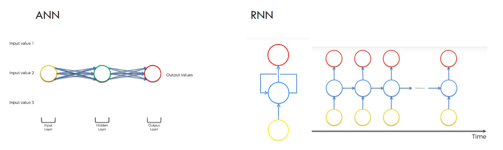
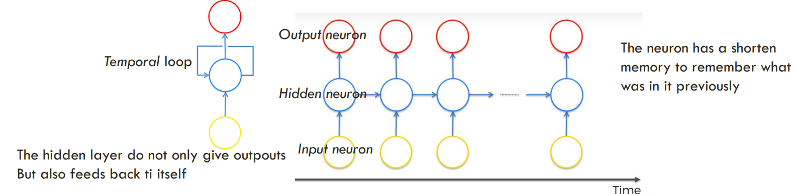
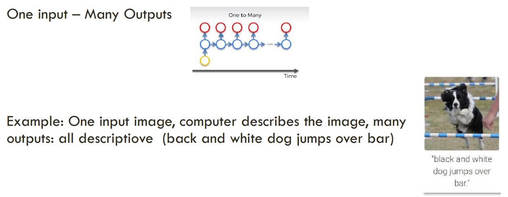
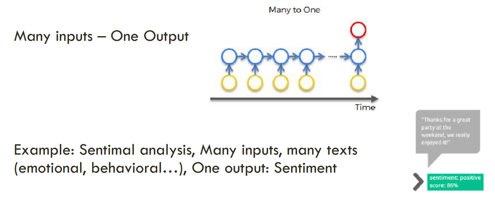
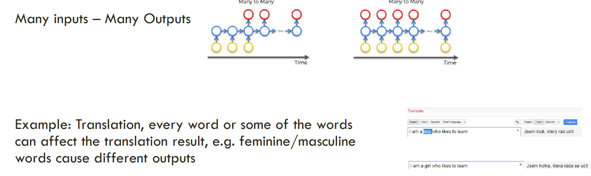
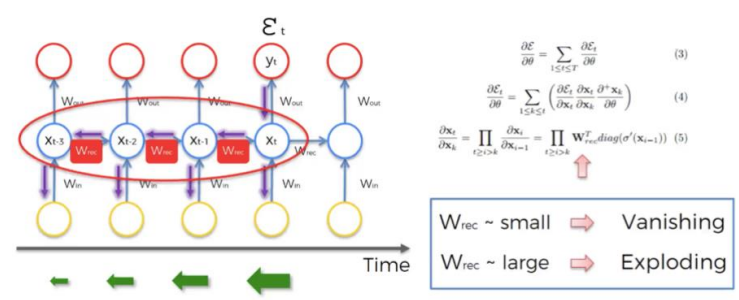

# 🧠 Deep Learning – Recurrent Neural Networks (RNN)

---

## 📚 Références principales

* *Deep Learning A–Z* — Kirill Eremenko & Hadelin de Ponteves (@SuperDataScience)
* *Deep Learning – Artificial Intelligence* — Sarah Malaeb

---

## 🔹 1. Introduction

Les **Réseaux de Neurones Récurrents (RNN)** sont une architecture de Deep Learning conçue pour traiter des **données séquentielles ou temporelles**.

🧠 Contrairement à un **réseau de neurones classique (ANN)**, le RNN possède une **mémoire interne** qui lui permet de **retenir l’information précédente** pour influencer la sortie suivante.

Exemples de données séquentielles :

* 📝 du texte (phrases, documents),
* 🎵 des signaux audio ou musicaux,
* 📈 des séries temporelles (financières, météo, IoT).

---

## 🔹 2. Motivation : pourquoi un RNN ?

Les réseaux **feed-forward (ANN)** traitent chaque donnée indépendamment.
👉 Ils ne savent pas que la donnée précédente influence la suivante.

Exemple :
Si tu veux prédire le mot suivant dans

> “Le chat mange une …”
> un réseau classique **ne se souvient pas** des mots précédents.

🧩 Les **RNN**, eux, gardent une trace de ce qu’ils ont vu avant :

> “Le chat mange une 🐟”
> ➡️ Le modèle sait que “mange” précède “une” et que “une” est souvent suivi d’un objet comestible.



---

## 🔹 3. Définition et principe

Un **RNN (Recurrent Neural Network)** est un réseau dans lequel **les connexions forment une boucle temporelle**.

Chaque neurone caché envoie **sa sortie précédente** comme **entrée de la couche cachée suivante**, en plus de la donnée actuelle.

### 🔁 Schéma conceptuel

```
xt  →  [ RNN Cell ] → ht  →  yt
 ↑          ↓
xt-1 → [ RNN Cell ] → ht-1
 ↑          ↓
xt-2 → [ RNN Cell ] → ht-2
```

Formules :
[
h_t = f(W_x x_t + W_h h_{t-1} + b)
]
[
y_t = g(W_y h_t)
]

où :

* (x_t) : entrée à l’instant t
* (h_t) : état caché (mémoire du réseau)
* (y_t) : sortie du réseau
* (W_x, W_h, W_y) : poids appris
* (f, g) : fonctions d’activation



---

## 🔹 4. Exemple intuitif

Imagine que tu lis une phrase mot par mot :

> “Le chat saute sur la table”

Un RNN :

1. Lit “Le” → crée une première mémoire (h_1)
2. Lit “chat” → se souvient de “Le”
3. Lit “saute” → sait qu’un sujet “Le chat” précède
4. Lit “table” → comprend la structure complète

➡️ Il comprend donc le **contexte**.

---

## 🔹 5. Différence entre CNN et RNN

| Critère         | CNN                               | RNN                                     |
| --------------- | --------------------------------- | --------------------------------------- |
| Type de données | Images, matrices                  | Séquences (texte, audio, séries)        |
| Connexions      | Spatiales (voisinage)             | Temporelles (temps t-1 → t)             |
| Mémoire         | Non                               | Oui                                     |
| Applications    | Vision, détection, reconnaissance | Langage, séries temporelles, prédiction |

---

## 🔹 6. Types de structures RNN

| Type             | Description                           | Exemple                                  |
| ---------------- | ------------------------------------- | ---------------------------------------- |
| **One-to-One**   | Entrée unique → Sortie unique         | Classification simple                    |
| **One-to-Many**  | Entrée unique → Plusieurs sorties     | Génération d’image en texte (captioning) |
| **Many-to-One**  | Plusieurs entrées → Une sortie        | Analyse de sentiment                     |
| **Many-to-Many** | Plusieurs entrées → Plusieurs sorties | Traduction automatique, sous-titrage     |







---

## 🔹 7. Problème du Vanishing Gradient

### 🧩 7.1. Le problème

Lors de la backpropagation à travers le temps (**BPTT**), les gradients sont multipliés plusieurs fois par les mêmes poids récurrents (w_{rec}).

[
\text{Si } w_{rec} < 1, \text{ alors le gradient devient de plus en plus petit : } \rightarrow 0
]

➡️ Les poids ne se mettent plus à jour efficacement → le réseau **oublie les informations anciennes**.

Inversement, si (w_{rec} > 1), on a un **exploding gradient** (valeurs trop grandes).



---

### ⚠️ 7.2. Conséquences

* Le réseau ne “mémorise” que les informations récentes.
* L’apprentissage devient instable ou lent.

---

### 🔧 7.3. Solutions

#### ✅ Pour le **vanishing gradient**

* Initialisation adaptée des poids (Xavier, He).
* Réseaux à mémoire longue : **LSTM** et **GRU**.
* Troncature de la rétropropagation (Backpropagation Through Time limitée).

#### ✅ Pour le **exploding gradient**

* Clipping du gradient (on fixe une valeur maximale).

---

## 🔹 8. Les LSTM (Long Short-Term Memory)

### 💡 Motivation

Le LSTM est une **évolution du RNN** conçue pour **retenir les informations sur de longues périodes**.

---

## 🔸 8.1. Architecture interne d’un LSTM (Long Short-Term Memory)

### 🔹 8.1.1 Structure générale

Un **LSTM** est une cellule de RNN améliorée, capable de **conserver ou d’oublier des informations** à volonté, grâce à un mécanisme de **portes (gates)**.

Chaque cellule LSTM reçoit :

* l’entrée actuelle ( x_t ),
* la sortie précédente ( h_{t-1} ),
* et la mémoire précédente ( C_{t-1} ).

Elle renvoie :

* une **nouvelle mémoire** ( C_t ),
* une **nouvelle sortie** ( h_t ).

📘 En résumé :
[
(x_t, h_{t-1}, C_{t-1}) \longrightarrow (h_t, C_t)
]

---

### 🔹 8.1.2 Les 3 portes d’un LSTM

Chaque “porte” est un petit réseau qui décide **combien d’information** doit passer.

| Porte              | Rôle                       | Fonction d’activation             |
| ------------------ | -------------------------- | --------------------------------- |
| 🧹 **Forget Gate** | Oublier les infos inutiles | Sigmoid (0 → oublier, 1 → garder) |
| 💾 **Input Gate**  | Ajouter de nouvelles infos | Sigmoid + tanh                    |
| 🚪 **Output Gate** | Produire la sortie         | Sigmoid + tanh                    |

---

### 🔹 8.1.3 La Forget Gate (porte d’oubli)

Formule :
[
f_t = \sigma(W_f [h_{t-1}, x_t] + b_f)
]

📘 Elle reçoit la concaténation de (h_{t-1}) et (x_t), puis décide **quelles informations de la mémoire passée (C_{t-1})** doivent être oubliées.

🧠 Interprétation :

* Si (f_t ≈ 0) → on oublie cette information.
* Si (f_t ≈ 1) → on la garde.

💬 Exemple :

> Si tu lis une phrase : “Le chat est mignon, mais il **griffe**.”
> La forget gate va décider d’oublier “mignon” (émotion positive) pour retenir “griffe” (information négative).

---

### 🔹 8.1.4 La Input Gate (porte d’entrée)

Elle décide **quelles nouvelles informations** ajouter à la mémoire à long terme.

Formules :
[
i_t = \sigma(W_i [h_{t-1}, x_t] + b_i)
]
[
\tilde{C}*t = \tanh(W_C [h*{t-1}, x_t] + b_C)
]

Ensuite, la nouvelle mémoire candidate (\tilde{C}*t) est **pondérée** par (i_t) :
[
C_t = f_t * C*{t-1} + i_t * \tilde{C}_t
]

🧠 Interprétation :

* (i_t) → décide *si on met à jour* une information.
* (\tilde{C}_t) → représente *la nouvelle information à stocker*.

💬 Exemple :

> Dans une phrase, “le chien **aboie** fort”, le LSTM ajoute à sa mémoire l’idée d’“aboiement”.

---

### 🔹 8.1.5 La Output Gate (porte de sortie)

Elle contrôle **ce que la cellule renvoie à l’extérieur** (mémoire courte (h_t)).

Formules :
[
o_t = \sigma(W_o [h_{t-1}, x_t] + b_o)
]
[
h_t = o_t * \tanh(C_t)
]

🧠 Interprétation :

* (o_t) → filtre la mémoire interne pour produire la sortie visible.
* (\tanh(C_t)) → ramène la mémoire à une échelle comprise entre -1 et 1.

💬 Exemple :

> Si le LSTM a lu toute la phrase “Le chat dort paisiblement”,
> la output gate décide que la sortie finale (h_t) sera centrée sur “dort” = action principale.

---

### 🔹 8.1.6 Synthèse des formules du LSTM

[
\begin{cases}
f_t = \sigma(W_f [h_{t-1}, x_t] + b_f) & \text{Forget Gate}\
i_t = \sigma(W_i [h_{t-1}, x_t] + b_i) & \text{Input Gate}\
\tilde{C}*t = \tanh(W_C [h*{t-1}, x_t] + b_C) & \text{Mémoire candidate}\
C_t = f_t * C_{t-1} + i_t * \tilde{C}*t & \text{Nouvelle mémoire}\
o_t = \sigma(W_o [h*{t-1}, x_t] + b_o) & \text{Output Gate}\
h_t = o_t * \tanh(C_t) & \text{Nouvelle sortie}
\end{cases}
]

---

### 🔹 8.1.7 Interprétation complète du flux d’information

1. 🔹 **Entrée (x_t)** et **mémoire précédente (h_{t-1}, C_{t-1})** arrivent dans la cellule.
2. 🧹 La **forget gate** décide ce qu’on oublie.
3. 💾 La **input gate** décide ce qu’on ajoute.
4. 🧮 On **met à jour la mémoire (C_t)**.
5. 🚪 La **output gate** décide quelle partie de la mémoire devient la sortie (h_t).

---

### 🔹 8.1.8 Visualisation

```markdown

```

🧠 Le schéma montre bien :

* Les 3 portes (Forget, Input, Output)
* Le flux de la mémoire (C_t) en haut
* Le flux des sorties (h_t) en bas
* Les opérateurs (\sigma) et (\tanh)

---

### 🔹 8.1.9 Points clés à retenir

✅ LSTM ≠ simple RNN :

> il choisit intelligemment quoi **oublier**, **retenir**, et **transmettre**.

✅ Les LSTM permettent :

* De **mémoriser des dépendances longues** dans les séquences (ex : contexte grammatical, relations de mots lointains).
* D’éviter le **vanishing gradient**.

✅ Utilisé massivement dans :

* Traduction automatique (Seq2Seq)
* Analyse de sentiments
* Génération de texte (ChatGPT, entre autres 😄)

---

## 🔹 9. GRU (Gated Recurrent Unit)

Une version plus simple du LSTM, avec seulement **2 portes** :

* 🔁 **Update Gate** (mélange input + forget)
* 🔒 **Reset Gate**

Moins de paramètres → plus rapide à entraîner.

---

## 🔹 10. Application : NLP (Natural Language Processing)

Les RNN et LSTM sont très utilisés pour le **traitement du langage naturel (NLP)** :

* Prédiction de mots (Word Prediction)
* Traduction automatique (Seq2Seq)
* Analyse de sentiment (Positive / Negative)
* Génération de texte (Chatbots, Résumés automatiques)

---

### ⚙️ Étapes du traitement de texte (NLP)

1. **Tokenization** → découpe du texte en mots ou phrases.
2. **Stop-word removal** → suppression des mots fréquents inutiles (“le”, “de”, “et”...).
3. **Lemmatisation / Stemming** → réduction des mots à leur racine (“mangeait” → “manger”).
4. **Part-of-speech tagging** → identification grammaticale (verbe, nom, adjectif).
5. **Word Embedding** → transformation des mots en vecteurs numériques.

---

### 📊 Techniques de Word Embedding

| Méthode          | Description                              |
| ---------------- | ---------------------------------------- |
| **Bag of Words** | Compte la fréquence des mots             |
| **TF-IDF**       | Pondère selon l’importance du mot        |
| **Word2Vec**     | Apprend des vecteurs sémantiques         |
| **FastText**     | Prend en compte la morphologie           |
| **Seq2Seq**      | Architecture pour traduction automatique |

---

## 🔹 11. Exemple pratique : Prédiction de texte avec LSTM (Keras)

```python
from tensorflow.keras.models import Sequential
from tensorflow.keras.layers import LSTM, Dense, Embedding

model = Sequential([
    Embedding(input_dim=10000, output_dim=128, input_length=50),
    LSTM(128, return_sequences=False),
    Dense(64, activation='relu'),
    Dense(1, activation='sigmoid')
])

model.compile(loss='binary_crossentropy', optimizer='adam', metrics=['accuracy'])
model.summary()
```

---

## 🔹 12. Récapitulatif

| Réseau         | Spécificité                   | Utilisation                 |
| -------------- | ----------------------------- | --------------------------- |
| **ANN**        | Données indépendantes         | Classification simple       |
| **CNN**        | Données spatiales (images)    | Vision par ordinateur       |
| **RNN**        | Données séquentielles (temps) | Texte, séries, sons         |
| **LSTM / GRU** | Mémoire longue durée          | NLP, prévision séquentielle |

---

## ✅ À retenir

🔹 Les RNN apprennent à partir de **séquences dépendantes du temps**.
🔹 Ils utilisent leur **état caché** pour mémoriser des informations précédentes.
🔹 Les **LSTM** et **GRU** corrigent les limites des RNN classiques (vanishing gradient).
🔹 Ils sont à la base des modèles modernes de traitement du langage (NLP, ChatGPT, etc.).

